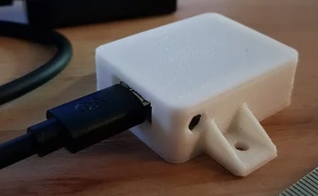

# FakeGPS
## ESP8266-NTP-timeserver for Nixie-clocks from PV Electronics
Forked from https://github.com/xSnowHeadx/FakeGPS  

## Introduction
The company [PV Electronics](https://www.pvelectronics.co.uk) from the UK sells nice Nixie-clocks:

Unfortunately these clocks only have a crystal oscillator to keep time but this isn't very accurate and it also doesn't provide automatic daylight savings changes. To get the exact time you can buy an [NTP-client](https://www.pvelectronics.co.uk/index.php?main_page=product_info&cPath=10&products_id=188) from the same company for $40 or... you make one by yourself for $3 with better features. 

## Function
The FakeGPS requests the UTC-Time from a NTP-Server over WiFi and internet and generates a GPRMC-Message in the GPS-Format NMEA-0183 as required by the Clock. Because GPS-Time normally is UTC-time without localisation or DST-information a clock with the original receiver has to be set in DST-mode manually on every DST-change. 

This converter generates a timestamp in local time considering the DST-state. So the clock can be set on a UTC offset of 0 and doesn't need any configuration or switching to/from DST on the clock. To calculate the correct local time it is necessary to configure the DST-rules (see the `myDST` and `mySTD` variables in main.cpp) according to your location. How to do this is described in the library [Timezone](https://github.com/JChristensen/Timezone). 

On first usage or when the module can't connect to the local WiFi-network it starts as accesspoint named "NixieAP". Connect to this AP and configure the SSID and password of your local network as described [here](https://github.com/tzapu/WiFiManager). The module will save your WiFi configuration and then connect to your network, query an NTP-server and update your clock at a regular interval.

## Hardware
* A [Wemos D1 mini](https://www.aliexpress.com/item/32651747570.html)
* A [3.5mm Stereo-plug with cable](https://www.aliexpress.com/item/4000341990326.html)

![Wemos D1 mini]](pictures/WemosD1mini.jpg)

The serial signal comes from pin TXD1 (GPIO2, D4) of the Wemos D1 mini with 9600 baud. Connect the audioplug to 5V, GND and signal [as described in the assembly instructions of the clock](pictures/manual_excerpt.png) and configure the timereceiver of the clock for GPS-Format and 9600 Baud (set parameter `12` to value `4` (GPS) and parameter `13` to `1` (9600 baud)).

If you like to put your Wemos D1 mini in a case there is a [minimalistic one](https://www.thingiverse.com/thing:2764626) available at Thingyverse.

 
## Software
Because the Wemos D1 mini is Arduino-compatible it can be programmed with any IDE for Arduino; this project is intended for [PlatformIO](https://platformio.org/).